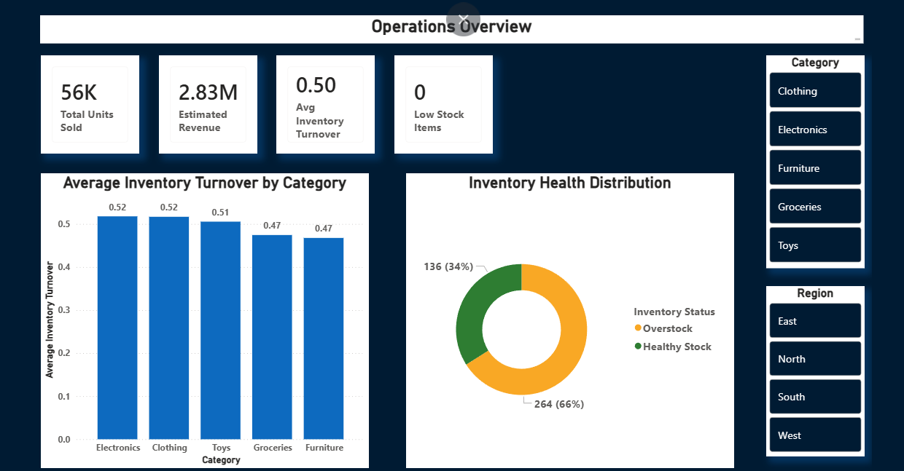
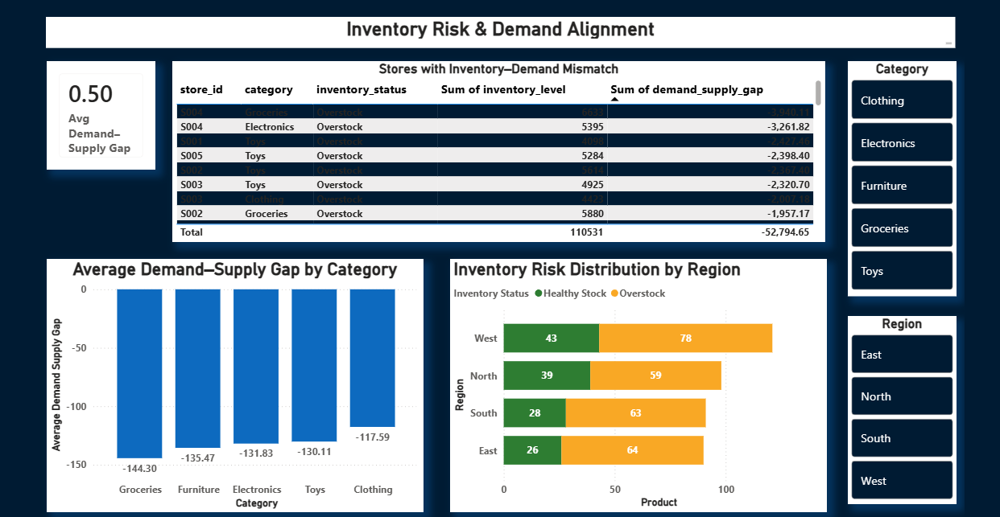
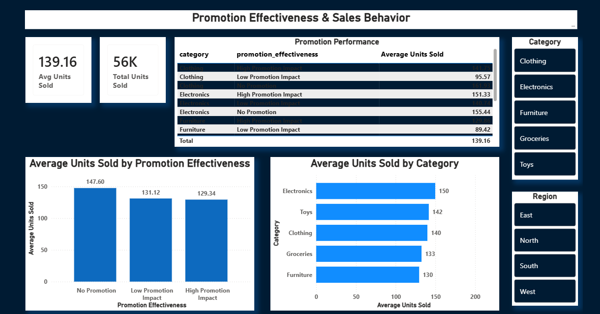

# 📊 Retail Inventory, Demand & Promotion Analytics

## Overview
This project delivers an end-to-end **Business Intelligence (BI) solution** that transforms raw retail inventory data into **decision-ready insights**.  
It focuses on **inventory efficiency, demand–supply alignment, and promotion effectiveness**, using SQL as the source of truth and Power BI for interactive analytics.

The solution emphasizes **interpretability and operational decision support** rather than predictive modeling, closely reflecting real-world BI practices.

---

## 🎯 Business Objectives
- Assess overall inventory health and operational performance  
- Identify demand–supply mismatches and inventory risk areas  
- Analyze inventory efficiency across product categories and regions  
- Evaluate promotion effectiveness relative to demand expectations  
- Enable data-driven decision-making through interactive dashboards  

---

## 🧱 Analytics & BI Architecture

| Layer | Tool | Purpose |
|-----|-----|--------|
| Data Modeling | SQL (MySQL) | Staging, KPI engineering, business rules |
| Analysis & Validation | Python | EDA, sanity checks, insight validation |
| Visualization | Power BI | Executive dashboards & decision support |

SQL acts as the **single source of truth**, while Python and Power BI consume curated BI-ready datasets.

---

## 🗄️ SQL: Data Modeling & KPI Engineering

### 1. Staging Layer
- Cleaned and standardized raw retail inventory data  
- Renamed fields into analytics-friendly formats  
- Applied defensive filtering to remove invalid records  

### 2. KPI Engineering
Engineered core operational metrics including:
- Inventory Turnover  
- Demand–Supply Gap  
- Estimated Revenue & Margin  
- Inventory Health Status (Low / Healthy / Overstock)  

Defensive SQL techniques (e.g., `NULLIF`) were used to ensure robustness.

### 3. BI-Ready Final View
A final SQL view was created to serve as the **single source of truth** for:
- Power BI dashboards  
- Python analysis  

This ensures consistency across analytics and reporting.

---

## 🐍 Python: Analysis & Validation
Python was used **only after SQL modeling**, to:
- Validate KPI distributions and sanity checks  
- Perform exploratory analysis on inventory efficiency and demand gaps  
- Analyze promotion effectiveness and sales behavior  
- Support insights with simple visual exploration  

---

## 📊 Power BI Dashboard

### Page 1 — Operations Overview

- Total Units Sold  
- Estimated Revenue  
- Average Inventory Turnover  
- Inventory Health Distribution  
- Category & Region filters  

### Page 2 — Inventory Risk & Demand Alignment

- Demand–Supply Gap by Category  
- Inventory–Demand mismatch by Store  
- Inventory risk distribution by Region  

### Page 3 — Promotion Effectiveness & Sales Behavior

- Average Units Sold by Promotion Effectiveness  
- Category-level promotion performance  
- Sales behavior comparison across categories  

Each page answers a **distinct business question**, avoiding redundancy.

---

## 🧠 Key Insights
- Inventory efficiency varies moderately across product categories  
- Demand–supply gaps highlight areas of overstock risk rather than stockouts  
- High absolute sales volumes do not necessarily result from promotions  
- Promotion effectiveness is better evaluated relative to demand expectations  
- Targeted operational decisions are more effective than blanket strategies  

---

## ⚠️ Assumptions & Limitations
- Margin values are estimated using competitor pricing as a cost proxy  
- Results should be interpreted comparatively, not as financial reporting  
- Analysis focuses on operational insight rather than prediction  

---

## 🧰 Tools & Technologies
- **SQL (MySQL)** — Data modeling & KPI engineering  
- **Python** — Pandas, NumPy, Matplotlib  
- **Power BI** — Interactive dashboards  
- **Jupyter Notebook / Google Colab**

---

## 🏁 Conclusion
This project demonstrates how **structured SQL modeling, disciplined analysis, and clear BI design** can transform retail data into actionable insights.  
The workflow mirrors real analytics environments and showcases skills relevant to **entry-level Data Analyst and Junior BI Developer roles**.

---

## 👤 Author
**Muhammed Nafih**  
Data Analyst | BI Developer

🔗 **LinkedIn:**  
https://www.linkedin.com/in/nafihhmohd/

---

## ▶️ How to Run
1. Clone the repository  
   ```bash
   git clone https://github.com/nafihhmohd/retail-operations-bi.git
   
